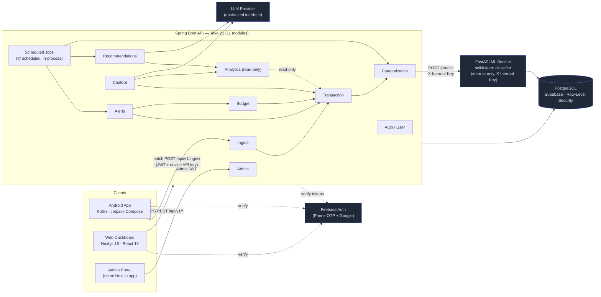
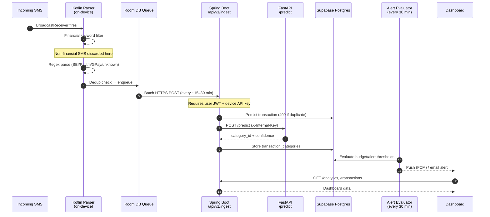
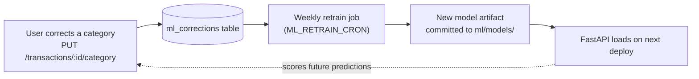
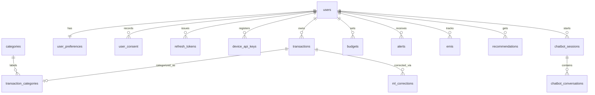

<div align="center">

<!-- Banner placeholder — see "Visual Assets Guide" for exact spec -->


# SpendWise

**Your money, unified.** SpendWise reads transaction SMS straight off your phone, auto-categorizes every rupee with a self-trained ML model, and gives you one dashboard for spending across every UPI app and bank — instead of five disconnected ones.

[](https://github.com/SytherAsh/SpendWise-v2/actions/workflows/ci.yml)


Live demo not yet deployed (Epic 12, in progress) · [Report a bug](https://github.com/SytherAsh/SpendWise-v2/issues) · [Documentation](./docs)

</div>

---

## Table of Contents

- [Problem Statement](#problem-statement)
- [Why This Project Exists](#why-this-project-exists)
- [Key Features](#key-features)
- [Architecture Overview](#architecture-overview)
- [Tech Stack](#tech-stack)
- [Project Structure](#project-structure)
- [Installation](#installation)
- [Environment Variables](#environment-variables)
- [Running Locally](#running-locally)
- [Docker](#docker)
- [API Overview](#api-overview)
- [AI/ML Pipeline](#aiml-pipeline)
- [Database Design](#database-design)
- [Security Considerations](#security-considerations)
- [Performance Optimizations](#performance-optimizations)
- [Testing](#testing)
- [Deployment](#deployment)
- [Roadmap](#roadmap)
- [Visual Assets Guide](#visual-assets-guide)
- [Contributing](#contributing)
- [License](#license)
- [Author](#author)

---

## Problem Statement

In India, a single household's money moves through Paytm, GPay, PhonePe, and a bank app — often all four in the same week. Every one of those apps has its own transaction history, its own categorization (if any), and no idea what happened in the other three. Answering "where did my money actually go this month?" means manually reconciling four separate ledgers, none of which agree on categories, date ranges, or what counts as a "transaction."

Existing personal-finance apps either require manual entry (which nobody keeps up with past week two) or bind to a single bank's API (which doesn't exist in a usable form for most Indian UPI apps). The data people actually need already arrives on their phone, every time they pay for something — as an SMS.

## Why This Project Exists

SpendWise's premise: the SMS *is* the ledger. Every UPI/bank transaction in India triggers a confirmation SMS with amount, recipient, and reference number. If you can parse that reliably — on-device, without shipping raw message content anywhere — you get a real-time, gateway-agnostic transaction feed for free, with no bank API integration to maintain or beg for access to.

That single insight is the spine the rest of the system is built around: a Kotlin foreground service turns SMS into structured events, a self-trained classifier turns events into categorized spend, and a Spring Boot backend turns categorized spend into budgets, alerts, and a dashboard — all without a paid tier anywhere in the stack.

It started, and remains, a solo portfolio project: built to be genuinely used by its author's household first (~5–10 users at MVP), and to demonstrate production-shaped engineering — module boundaries, RLS-backed multi-tenancy, a real CI matrix, ADR-documented decisions — end to end across four different runtimes.

## Key Features

- **Zero-effort transaction capture.** A Kotlin foreground service listens for incoming SMS in real time and backfills the existing inbox on first launch — no manual entry, no bank API keys.
- **Gateway-agnostic parsing.** Purpose-built regex parsers for SBI, Paytm, and GPay SMS formats, plus a keyword-based fallback for unrecognized senders, with two-layer (client + server) deduplication.
- **Self-improving ML categorization.** A scikit-learn classifier — trained on 1,810 real, hand-labeled transactions from a 4-year bank statement — sorts every transaction into one of 12 categories, and every user correction feeds back into weekly batch retraining.
- **Budgets that actually warn you.** Per-category budgets with mid-month 50% and 80%-approaching-limit thresholds, evaluated every 30 minutes and dispatched via push (FCM) and email.
- **Automatic EMI & subscription detection.** A recurring-payment heuristic (3+ same-recipient transactions within a 60-day window, amounts within ±10%) surfaces subscriptions and EMIs without the user tracking them manually.
- **LLM-powered recommendations and chatbot.** Threshold-triggered savings insights and a context-aware chatbot that can answer questions against a user's real transaction history — both behind a provider-agnostic LLM interface, so no vendor SDK is hardwired into business logic.
- **Interactive analytics with export.** Week/month/year comparisons, category trend lines, and PDF/CSV export (including Indian-financial-year exports).
- **A real admin portal.** Cross-user monitoring, parser health, ML accuracy tracking, manual retrain triggers, and DPDP-compliant hard-delete — gated behind a completely separate JWT secret from the user auth path.

## Architecture Overview

SpendWise is a **modular monolith**: one Spring Boot deployable, 11 internally-bounded modules communicating through injected service interfaces (never concrete classes), with a dedicated FastAPI process for ML inference — chosen deliberately over microservices so the whole system fits on free-tier hosting while keeping extraction-ready seams (see [ADR-001](./docs/decisions.md)).



### SMS-to-Dashboard Data Flow



> Raw SMS text never leaves the device — only structured fields (`amount`, `recipient_name`, `upi_id`, `transaction_date`, …) are transmitted. See [Security Considerations](#security-considerations).

## Tech Stack

<table>
<tr><td valign="top">

**Mobile**
- Kotlin (native)
- Jetpack Compose + Material 3
- Room (offline queue)
- WorkManager (background sync)
- Hilt (DI)
- Coroutines

</td><td valign="top">

**Web Frontend**
- Next.js 16 (App Router)
- React 19 + TypeScript
- Tailwind CSS 4
- Radix UI + shadcn-style primitives
- Recharts, SWR, Firebase JS SDK
- `next-themes`, Framer Motion

</td><td valign="top">

**Backend**
- Spring Boot 3 (Java 21)
- Flyway migrations
- JUnit 5 + Testcontainers
- Spring Security (dual JWT filters)
- Modular monolith, 11 modules

</td></tr>
<tr><td valign="top">

**ML Service**
- FastAPI + Pydantic
- scikit-learn (RandomForest)
- pandas / numpy / joblib
- pytest

</td><td valign="top">

**Data & Auth**
- PostgreSQL (Supabase, free tier)
- Row-Level Security (session-scoped)
- Firebase Authentication (OTP + Google)

</td><td valign="top">

**Infra & Ops**
- Docker Compose (local Postgres)
- GitHub Actions (4-job CI matrix)
- Sentry, UptimeRobot
- Vercel / Render / Railway / Fly.io

</td></tr>
</table>

## Project Structure

```text
SpendWise-v2/
├── android/            Kotlin app — SMS ingestion, parsing, offline sync, Compose UI
│   └── app/src/main/kotlin/com/spendwise/
│       ├── sms/        BroadcastReceiver + foreground service lifecycle
│       ├── parser/     Regex rules (SBI, Paytm, GPay) + keyword fallback
│       ├── sync/       Room queue → batched HTTPS upload, retry on reconnect
│       ├── storage/    Room database + DAOs
│       └── ui/         Screens: dashboard, transactions, budget, chatbot, settings
│
├── backend/            Spring Boot REST API (Java 21) — modular monolith
│   └── src/main/java/com/spendwise/
│       ├── auth/ user/ ingest/ transaction/ categorization/
│       ├── budget/ alerts/ recommendations/ chatbot/
│       ├── analytics/ admin/
│       └── resources/db/migration/   Flyway migrations V1–V9
│
├── frontend/           Next.js web dashboard + admin portal
│   └── src/
│       ├── app/(app)/       Dashboard, Transactions, Analytics, Planning, Settings
│       ├── app/(auth)/      Login
│       ├── app/admin/       Admin portal (separate auth tree)
│       ├── components/      Feature components + shared UI primitives
│       └── lib/              API client (401-refresh), SWR hooks, theming, categories
│
├── ml/                 FastAPI categorization service
│   ├── api/            Routes: /predict, /retrain, /evaluate, /health
│   ├── training/        Feature pipeline (TF-IDF + OneHot) + RandomForest training
│   ├── labeling/        Rules-based auto-labeling + knowledge base for the training set
│   ├── evaluation/      Accuracy/F1/precision/recall reporting
│   └── models/          Committed model artifact (joblib)
│
├── docs/               Living specification — architecture, API, DB, security, ADRs
├── implementation/     Epic breakdown + task-level status tracking (114/125 done)
├── infra/              Hosting/infrastructure configuration
├── scripts/            Bank-statement import & utility scripts
└── tests/              Cross-surface end-to-end golden-path tests
```

## Installation

**Prerequisites**

| Tool | Version | Used by |
| --- | --- | --- |
| JDK | 21 | Backend, Android |
| Node.js | ≥ 20 (CI uses 22) | Frontend |
| Python | 3.11 | ML service |
| Docker | latest | Local Postgres |
| Android Studio | latest | Android app (optional for backend/web-only work) |

```bash
git clone https://github.com/SytherAsh/SpendWise-v2.git
cd SpendWise-v2

# Backend
cd backend && cp .env.example .env

# ML service
cd ../ml && python -m venv .venv && source .venv/bin/activate  # .venv\Scripts\activate on Windows
pip install -r requirements.txt
cp .env.example .env

# Frontend
cd ../frontend && npm install
cp .env.local.example .env.local
```

## Environment Variables

<details>
<summary><strong>Spring Boot Backend</strong> (<code>backend/.env</code>)</summary>

| Variable | Purpose |
| --- | --- |
| `SUPABASE_URL`, `SUPABASE_KEY` | Supabase client credentials |
| `SPRING_DATASOURCE_URL/_USERNAME/_PASSWORD` | Raw JDBC connection (defaults to local Docker Postgres) |
| `SPRING_DATASOURCE_JOBS_USERNAME/_PASSWORD` | Second, `BYPASSRLS` connection pool for scheduled cross-user jobs |
| `FIREBASE_PROJECT_ID`, `FIREBASE_PRIVATE_KEY` | Firebase Admin SDK — token verification + push |
| `FASTAPI_ML_URL` | Internal URL of the ML service |
| `ML_INTERNAL_KEY` | Shared secret sent as `X-Internal-Key` on every ML call |
| `ML_LOW_CONFIDENCE_THRESHOLD` | Below this, a prediction is treated as failed (default `0.5`) |
| `ML_RETRAIN_CRON` | Cron schedule for weekly retraining (default Sun 03:00) |
| `JWT_SECRET` | User access/refresh token signing key |
| `ADMIN_JWT_SECRET`, `ADMIN_USERNAME`, `ADMIN_PASSWORD_HASH` | Fully separate admin auth path (bcrypt hash, never raw) |
| `EMAIL_SMTP_*` | Alert email dispatch |
| `SENTRY_DSN` | Error tracking |

</details>

<details>
<summary><strong>FastAPI ML Service</strong> (<code>ml/.env</code>)</summary>

| Variable | Purpose |
| --- | --- |
| `SUPABASE_URL`, `SUPABASE_KEY` | Read access for training/correction data |
| `MODEL_PATH` | Directory the trained artifact loads from at startup |
| `ML_INTERNAL_KEY` | Must match the backend's value |
| `SENTRY_DSN` | Error tracking |

</details>

<details>
<summary><strong>Next.js Frontend</strong> (<code>frontend/.env.local</code>)</summary>

| Variable | Purpose |
| --- | --- |
| `NEXT_PUBLIC_API_BASE_URL` | Spring Boot API base URL |
| `NEXT_PUBLIC_FIREBASE_API_KEY/_AUTH_DOMAIN/_PROJECT_ID/_APP_ID` | Firebase client SDK config |

</details>

> [!IMPORTANT]
> No secret is ever committed to Git. `.env`/`.env.local` are gitignored; only `.env.example` files are tracked. The Android app's `google-services.json` is likewise gitignored and required only for a runnable local build.

## Running Locally

The stack is **four services on four fixed ports**, started in order:

| # | Service | Port | Command (from its directory) |
| --- | --- | --- | --- |
| 1 | Postgres | `5433` | `docker compose up -d` |
| 2 | Backend | `8080` | `./gradlew bootRun` (loads `.env`) |
| 3 | ML service | `8000` | `uvicorn api.main:app --reload --port 8000` |
| 4 | Frontend | `3000` | `npm run dev` |

Postgres must be up first — the backend runs Flyway migrations on boot. Once all four are running, open **http://localhost:3000/login**.

Frontend and ML hot-reload on save; the backend does **not** — restart it after any Java or migration change.

## Docker

Only Postgres is containerized for local development — a deliberate choice to keep the backend/ML/frontend inner loop fast (native process restarts vs. rebuilding images), while still matching production's Postgres engine and SQL dialect exactly.

```bash
cd backend
docker compose up -d      # Postgres 16, port 5433, seeded via backend/db-init/*.sql
docker compose down       # stop (data persists in a named volume)
docker compose down -v    # stop and wipe the volume (re-runs db-init scripts on next up)
```

`backend/db-init/` provisions two Postgres roles on first volume creation: `spendwise_app` (the RLS-scoped role every request-time query uses) and `spendwise_jobs` (`BYPASSRLS`, used only by scheduled cross-user background jobs — see [Security Considerations](#security-considerations)).

## API Overview

All routes are versioned under `/api/v1/`. Protected routes require `Authorization: Bearer <jwt>`; admin routes require a token signed with a **completely separate** `ADMIN_JWT_SECRET`, rejected by the user-auth filter and vice versa. Full reference: [`docs/api.md`](./docs/api.md).

| Group | Endpoints | Notes |
| --- | --- | --- |
| `/auth` | OTP send/verify, Google login, token refresh, logout | Refresh tokens rotate on every use; replay detection revokes all sessions |
| `/users` | Profile, preferences, onboarding, bank-statement upload | Onboarding issues the one-time device API key |
| `/ingest` | `POST /ingest/transactions` | Dual auth (JWT + device key); duplicate `transaction_id` → `409`, treated as success |
| `/transactions` | List (cursor-paginated), get, create, correct category | Category correction writes an `ml_corrections` row for retraining |
| `/categories` | List the 12 fixed categories | |
| `/budgets` | CRUD, progress, history-based suggestions | `POST /budgets` is an idempotent upsert |
| `/alerts` | List, mark read, confirm as recurring payment | Confirming creates a tracked `emis` row |
| `/recommendations` | List, dismiss | LLM-generated, threshold-triggered |
| `/analytics` | Summary, categories, comparison, trends, PDF/CSV export | Read-only; comparison is always anchored to "today" |
| `/chatbot` | Sessions, message | Conversation history persists across app restarts |
| `/emis` | CRUD, deactivate | Owned by the Transaction module — EMIs are specialized transactions |
| `/admin/*` | Users, analytics, logs, ML accuracy/retrain, hard-delete | Admin JWT only; separate login endpoint |

<details>
<summary>Example — <code>POST /predict</code> internal ML call</summary>

```http
POST http://ml-service/predict
X-Internal-Key: ${ML_INTERNAL_KEY}
Content-Type: application/json

{
  "recipient_name": "Swiggy",
  "upi_id": "swiggy@okicici",
  "bank": "ICICI",
  "transaction_mode": "UPI",
  "amount": -350.0,
  "note": null
}
```

```json
{ "category_id": 7, "category_name": "Food / Dine Out", "confidence": 0.94 }
```

</details>

## AI/ML Pipeline

Categorization runs as its own FastAPI process, called internally and exclusively by the backend's Categorization module — never reached directly by any client.

**Model:** `RandomForestClassifier(n_estimators=300, class_weight="balanced")`, chosen over a linear model because the label distribution is heavily skewed (Transfers ~50% of the training set, several categories under 30 examples) and the feature space mixes text, categorical, and numeric fields without needing scaling.

**Features** (`ColumnTransformer`):

| Feature | Transform |
| --- | --- |
| `text` (recipient + note, concatenated) | TF-IDF, 1–2 grams |
| `bank`, `transaction_mode` | One-hot encoding |
| `amount` | Passthrough |

**Training data:** 1,810 hand-labeled transactions sourced from a real 4-year SBI bank statement, labeled through a rules-based auto-labeler plus an interactive review pass for the long tail (`ml/labeling/`), producing a merchant/keyword/counterparty knowledge base alongside the labeled set.

**Categories (12):** Shopping, Entertainment, Sports & Fitness, Groceries, Travel, Miscellaneous, Food / Dine Out, Cosmetics, Subscriptions, Transfers, Medical, Fees & Debt — the last two added once labeling surfaced real transactions with no home in the original ten.

**Feedback loop:**



Predictions below `ML_LOW_CONFIDENCE_THRESHOLD` (default `0.5`) are left uncategorized rather than silently wrong, and are retried by a background job once retraining improves coverage. Model artifacts are version-controlled and committed alongside service code — no external model registry at this stage; `docs/roadmap.md` Phase 4 scopes a future per-user fine-tuned model.

## Database Design

PostgreSQL via Supabase, one shared schema across all 11 backend modules, migrated with Flyway (`V1`–`V9`). All transaction data is retained indefinitely as a training asset unless a user exercises their right to erasure.



16 tables in total; the full DDL is in [`docs/database.md`](./docs/database.md). Notable design choices:

- **`transaction_id` dedup key.** For SMS without a bank reference number, a synthetic id is derived as `SHA-256(user_id + upi_id_or_recipient + amount + minute-truncated date)`, enforced by a unique index at the DB level — the ultimate backstop under the client-side and server-side dedup layers.
- **`sms_raw_text`** is stored for debugging only and is structurally excluded from every user-facing response DTO — never returned by any controller.
- **Row-Level Security everywhere.** Every RLS-protected table has `FORCE ROW LEVEL SECURITY`. Because the backend connects via a service-role-equivalent app role (where `auth.uid()` isn't populated), each request sets a transaction-scoped `app.current_user_id` session variable that RLS policies key off instead — a safe-fail-deny design where a missing variable denies access rather than erroring.
- **Two connection pools.** The default pool is RLS-scoped (`spendwise_app`); a second, explicitly-`@Primary`-avoided pool (`spendwise_jobs`, `BYPASSRLS`) exists solely for `@Scheduled` jobs and admin cross-user reads that have no single "current user" to scope to — see [Security Considerations](#security-considerations) for why this pairing needed a documented production fix.

## Security Considerations

- **On-device-only raw SMS.** Regex parsing happens entirely on the Android app; only structured fields ever leave the device. `sms_raw_text` is stored server-side for debugging but never serialized into an API response.
- **Dual-secret JWT design.** User sessions and admin sessions are signed with two independent secrets (`JWT_SECRET` vs. `ADMIN_JWT_SECRET`); each auth filter validates its own secret only, so a leaked or forged user token cannot touch admin routes even with a spoofed role claim.
- **Refresh token rotation + replay detection.** Every `/auth/token/refresh` call atomically revokes the presented token and issues a new one; presenting an already-rotated token is treated as a replay attack and revokes **all** of that user's sessions.
- **Dual-auth ingestion.** `/api/v1/ingest` requires both a valid user JWT and a device API key registered at onboarding, closing off spoofed-client transaction injection.
- **RLS as a backstop, not a substitute.** Every user-scoped query is explicitly filtered by `user_id` in application code *and* covered by a matching RLS policy — the two are intentionally redundant.
- **DPDP Act 2023 compliance (India).** A single onboarding consent screen covers SMS access, server-side storage, and ML training use; users can access, export (PDF/CSV), and request full erasure of their data, including scrubbing identifying fields from retained audit logs.
- **Least-privilege background jobs.** Scheduled jobs that must read across all users run on a separate, explicitly-provisioned `BYPASSRLS` database role — not a blanket bypass on the main connection — after an incident (documented in `docs/security.md`) where an implicitly-shadowed default `JdbcTemplate` bean nearly routed *all* traffic through the bypass role; the fix is now enforced by a regression test.
- **Encryption.** TLS 1.2+ on all API traffic; AES-256 at rest via Supabase; no plaintext secrets in Git (`.env*` gitignored, only `.example` files tracked).
- **Internal-only ML service.** FastAPI is never publicly reachable — every call from Spring Boot carries a shared-secret `X-Internal-Key` header, validated on every request.

## Performance Optimizations

- **Cursor-based pagination** on transactions and alerts avoids offset-scan cost as history grows into the tens of thousands of rows per user over a multi-year retention window.
- **Composite and dedup indexes** — `(user_id, transaction_date DESC)` for the hot list-view query path, and a unique `(user_id, transaction_id)` index that lets the dedup check reuse an index instead of a table scan.
- **Batched, not real-time, sync.** The Android app batches SMS uploads every 15–30 minutes instead of posting per-message — deliberately traded against real-time freshness (product requirement: users review spend at end of day, not live) to cut battery and network usage.
- **Lightweight ML inference.** TF-IDF + RandomForest over 12 classes was chosen specifically to keep inference cheap enough for free-tier compute — no GPU, no deep-learning runtime, sub-second predictions.
- **Two-pool connection design** keeps RLS-scoped request traffic and bulk background-job reads from contending on the same connection pool's session state.
- **Client-side stale-while-revalidate.** The web dashboard (SWR) and Android app both serve last-known-good data immediately and refresh in the background rather than blocking the UI on every request.

## Testing

| Surface | Framework | Test files |
| --- | --- | --- |
| Backend (unit) | JUnit 5 + Spring Boot Test | 37 |
| Backend (integration) | JUnit 5 + Testcontainers (real Postgres) | 25 |
| Frontend | Vitest + React Testing Library | 25 |
| Android | JUnit (Kotlin) | 16 |
| ML service | pytest | 7 |

**110 test files** across four languages/frameworks, all run on every push via a 4-job GitHub Actions matrix (`backend`, `ml`, `android`, `frontend`).

Integration tests run against a real PostgreSQL container via Testcontainers rather than H2 — the schema relies on Postgres-specific features (`ENUM`, `JSONB`, `gen_random_uuid()`, `set_config()` for RLS session variables) that an in-memory substitute can't faithfully emulate. Testing philosophy prioritizes the highest-risk logic first: SMS parsing, ingestion/dedup, and ML categorization.

```bash
# Backend
cd backend && ./gradlew test integrationTest

# ML service
cd ml && pytest tests/ -v

# Android
cd android && ./gradlew test

# Frontend
cd frontend && npm run lint && npm test && npm run build
```

## Deployment

| Component | Hosting | Notes |
| --- | --- | --- |
| Web dashboard | Vercel | Auto-deploys on push to `main` |
| Backend API | Render / Railway / Fly.io (free tier) | Always-on preferred — background jobs run on a schedule |
| ML service | Render / Railway / Fly.io (free tier) | Internal networking only, never public |
| Database | Supabase (Postgres, free tier) | |
| Auth | Firebase | Phone OTP + Google, also powers push (FCM) |
| Android distribution | Firebase App Distribution | Play Store listing is a post-MVP roadmap item |
| Error tracking | Sentry | Backend + ML |
| Uptime | UptimeRobot | Polls `GET /api/v1/health` every 5 minutes |

CI runs on every push to `main` (unit + integration + lint + build across all four surfaces); CD is **manual** — a developer reviews green CI, then deploys each service independently. There is no auto-deploy-on-merge for the backend or ML service by design, given the free-tier hosting constraint and solo-maintainer workflow.

## Roadmap

MVP (Epics 0–11) is feature-complete — 114/125 tracked tasks done, all four CI surfaces green. The one open MVP-track epic is **Epic 12 (Deployment, Monitoring & Launch)**; current day-to-day work is UI/UX polish on the web dashboard.

Post-MVP, in priority order: Hindi/Marathi localization → additional bank/gateway SMS parsers (HDFC, ICICI, Axis, PhonePe, Amazon Pay, Kotak) → investment/portfolio tracking → per-user fine-tuned ML models → Play Store distribution → Espresso UI test suite → a licensable categorization API → microservices extraction if free-tier limits are consistently hit. Full detail in [`docs/roadmap.md`](./docs/roadmap.md); architectural rationale for each major call is recorded in [`docs/decisions.md`](./docs/decisions.md) (11 ADRs).

## Visual Assets Guide

No screenshots or recordings are checked in yet. Suggested asset layout once captured:

```text
assets/
├── banner/        spendwise-banner.png   (1600×400, dark background matching the app theme)
├── screenshots/    onboarding.png, dashboard.png, transactions.png, planning.png,
│                   analytics.png, chatbot.png, admin.png   (1280×800, light + dark variants)
└── gifs/           see table below (960×540 or device-frame, <8MB each — GitHub's inline cap)
```

| Placement | What it should show | Duration | Recording tips |
| --- | --- | --- | --- |
| Hero (top of README) | 5-second loop: SMS arrives → transaction appears categorized on the dashboard | 5–8s | Split-screen phone + browser; this is the single most important asset — it *is* the product pitch |
| Onboarding / auth flow | Phone OTP entry → consent screen → permissions grant | 8–12s | Use the documented test phone number; blur/replace the real OTP if recording on a real device |
| Dashboard | Landing on the dashboard, scrolling through stat tiles and charts | 6–10s | Capture both light and dark theme if `next-themes` support is a talking point |
| Core workflow (categorization) | Correcting a transaction's category and seeing it reflected instantly | 6–10s | Highlights the ML feedback loop concretely — pair with a one-line caption |
| AI features | A chatbot exchange referencing real spend data ("how much did I spend on food last month?") | 10–15s | Pick a question whose answer is visibly correct against the visible transaction list |
| Analytics / reports | Switching date ranges and exporting a PDF | 6–10s | Show the exported file opening, not just the export button click |
| Mobile responsiveness | Same dashboard page at desktop → tablet → phone widths | 5–8s | Browser dev-tools device toolbar is fine; no need for a real device |

Keep every GIF under GitHub's ~10MB inline-render ceiling (8MB is a safer target); prefer a short, tightly-cropped capture over a long one — README GIFs should read as a proof point, not a demo video.

## Contributing

This is currently a solo portfolio project developed directly on `main` (see [`docs/development_guidelines.md`](./docs/development_guidelines.md) for the branching/commit conventions used internally). External contributions aren't the primary workflow today, but issues and suggestions are welcome via [GitHub Issues](https://github.com/SytherAsh/SpendWise-v2/issues). If you'd like to contribute code, please open an issue first to discuss scope — the module-boundary and security invariants in [`CLAUDE.md`](./CLAUDE.md) apply to any change.

## License

No license file is currently published in this repository — all rights reserved by default. If you'd like to use this code, please reach out first (see below).

## Author

**Yash Sawant**
B.Tech Computer Science (AI & ML), Sardar Patel Institute of Technology · SDE Intern @ Nomura

[Portfolio](https://sytherash.github.io) · [GitHub](https://github.com/SytherAsh) · [LinkedIn](https://www.linkedin.com/in/yash-sawant-14b53826a/) · [Email](mailto:yashsawnt2703@gmail.com)
